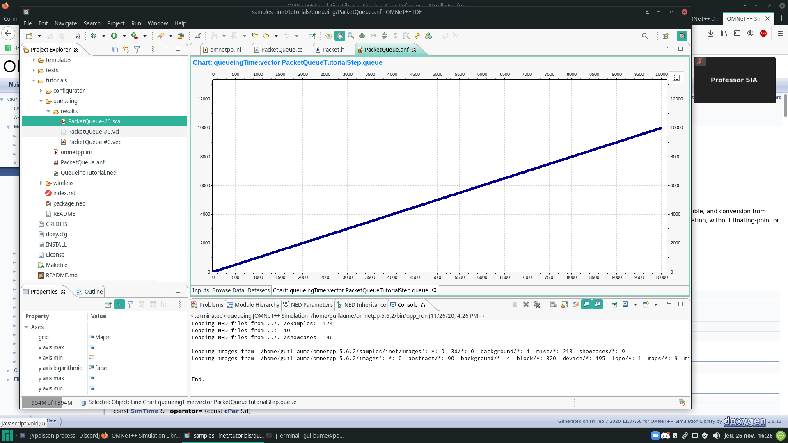
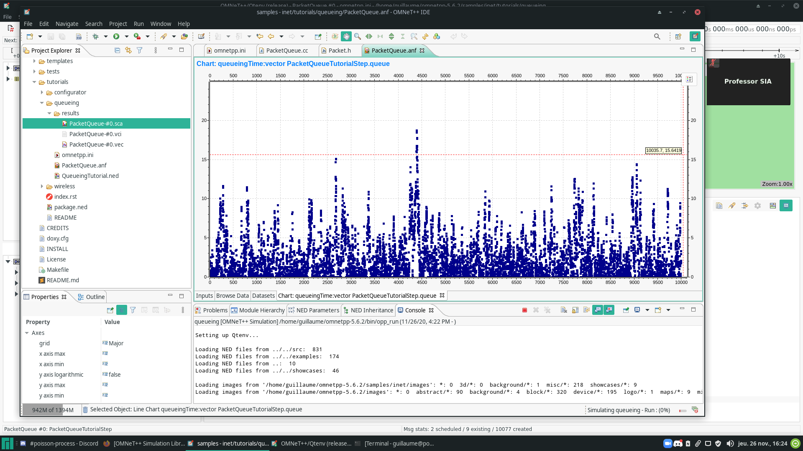

# TP - 01

Guillaume Cau

## Set the parameters to 1s for the mean inter arrival time between packets with exponential probability distribution.

To change the *inter arrival time*, we need to change the parameter **\*.producer.productionInterval** of the `ini` file.
The exponential probability distribution is configurable with the *exponential()* function. To set it to **1s**, simply set the parameter of *exponential* to **1** :

```
*.producer.productionInterval =  exponential(1s)
```

## Set the mean service time to 0,75 seconds with exponential probability distribution.

To change the *mean service time*, we can use the same methods as for the *inter arrival time* :

```
*.collector.collectionInterval = exponential(0.75s)
```

## Give the mathematical formula for the following metrics : mean queue size, mean waiting time in the queue.

The mathematical formula for the **mean queue size** is : 


And :


The mathematical formula for the **mean waiting time** is :

})


## You will have to modify the sources to measure queueing time in simulation : set the arrival time field of the packets by adding one line to the sources at the right location in the appropriate source file.

For this, I have used the **setArrivalTimeFunction** when the packet is pushed in the queue :

```c++
/* inet/src/inet/queueing/queue/PacketQueue.cc */

void PacketQueue::pushPacket(Packet *packet, cGate *gate)
{
    Enter_Method("pushPacket");
    EV_INFO << "Pushing packet " << packet->getName() << " into the queue." << endl;
    queue.insert(packet);

    /* Add of lab1 (26/11/2020) : */
    packet->setArrivalTime(simTime());

    emit(packetPushedSignal, packet);
    if (buffer != nullptr) {
        buffer->addPacket(packet);
    } else if (isOverloaded()) {
        if (packetDropperFunction != nullptr) {
            while (!isEmpty() && isOverloaded()) {
                auto packet = packetDropperFunction->selectPacket(this);
                EV_INFO << "Dropping packet " << packet->getName() << " from the queue.\n";
                queue.remove(packet);
                dropPacket(packet, QUEUE_OVERFLOW);
            }
        }
        else
            throw cRuntimeError("Queue is overloaded but packet dropper function is not specified");
    }
    updateDisplayString();
    if (collector != nullptr && getNumPackets() != 0)
        collector->handleCanPopPacket(outputGate);
}
```

When this modification was done, we can now access to the queueing time :


## Simulate and compare the results with the mathematical formula.

When the modification of `PacketQueue.cc` is done, we can compute the statistics correctly.

Before the modification :



After the modification :




For the mean queue size :

$$\frac{\lambda}{\mu} = \frac{\frac{1}{1}}{\frac{1}{0.75}} = 0,75$$
So, we can now compute the mean queue size :
$$\frac{0.75}{1-0.75} = 3$$
Our result is **3** that correspond to the result of the simulation (3.144).

For the mean waiting time :
$$\frac{0.75}{1.33(1-0.75)} = 2.25$$

Our result is **2.25** that correspond with the result of the simulation (2.21).


## Comment the file PacketQueue.ned  by explaining the lines of the source file, especially the statistics and signals parts.

```
        @class(PacketQueue);
        @signal[packetPushed](type=inet::Packet);
        @signal[packetPopped](type=inet::Packet);
        @signal[packetRemoved](type=inet::Packet);
        @signal[packetDropped](type=inet::Packet);
        @statistic[packetPushed](title="packet pushed"; record=count,sum(packetBytes),vector(packetBytes); interpolationmode=none);
        @statistic[packetPopped](title="packet popped"; record=count,sum(packetBytes),vector(packetBytes); interpolationmode=none);
        @statistic[packetRemoved](title="packets removed"; record=count,sum(packetBytes),vector(packetBytes); interpolationmode=none);
        @statistic[packetDropQueueOverflow](title="packet drops: queue overflow"; source=packetDropReasonIsQueueOverflow(packetDropped); record=count,sum(packetBytes),vector(packetBytes); interpolationmode=none);
        @statistic[queueingTime](title="queueing times"; source=queueingTime(packetPopped); record=histogram,vector; unit=s; interpolationmode=none);
        @statistic[queueLength](title="queue length"; source=count(packetPushed) - count(packetPopped) - count(packetRemoved) - count(packetDropped); record=max,timeavg,vector; interpolationmode=sample-hold);
```

In the *PacketQueue.ned*, we can found a lot of different configuration :

 - The **@class** represent whih class is configured.
 - The **@signal** represent an event that occur during the simulation, it will appear in the *scalars* section of the results.
 - The **@statistic** represent a statistic computed during the simulation, as the *signals*, it use the events, but keep the data of all the simulation and adapt them.

