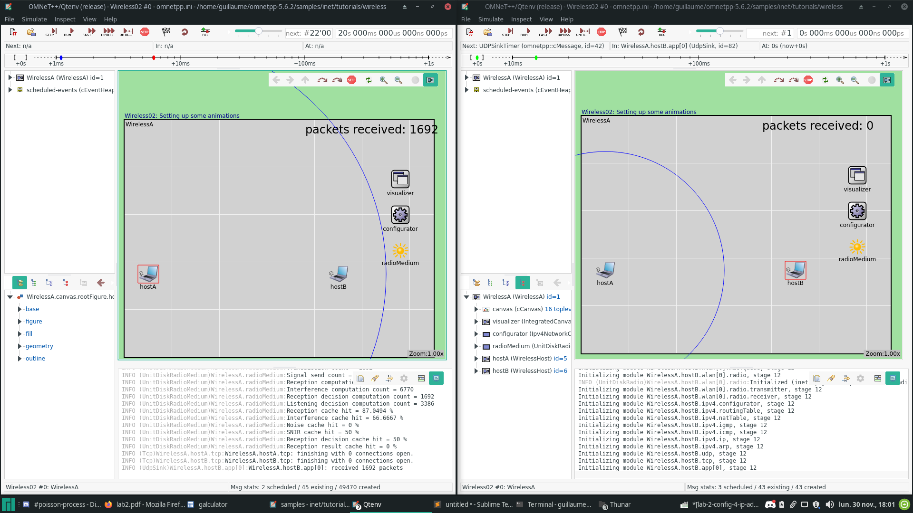
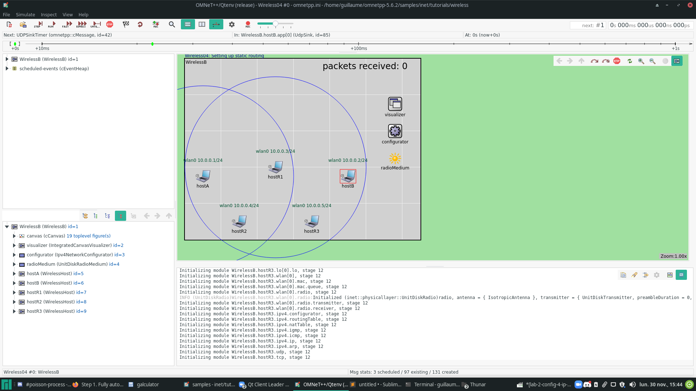
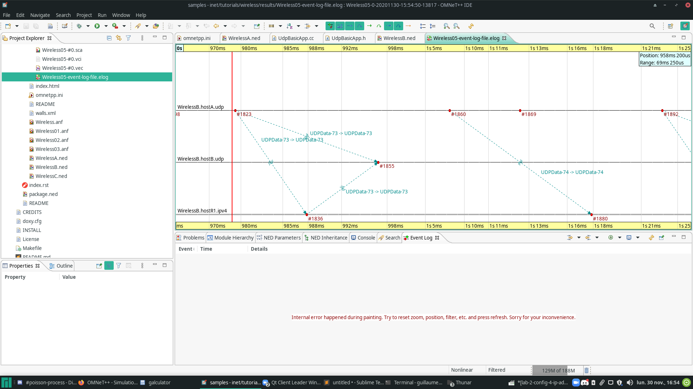
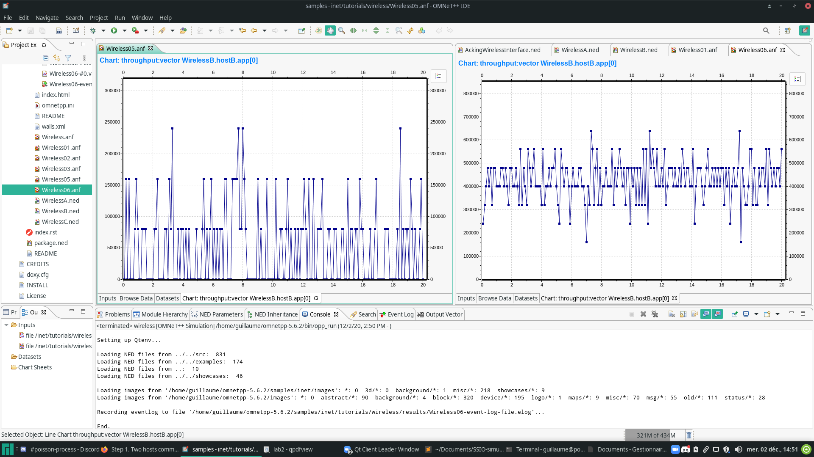
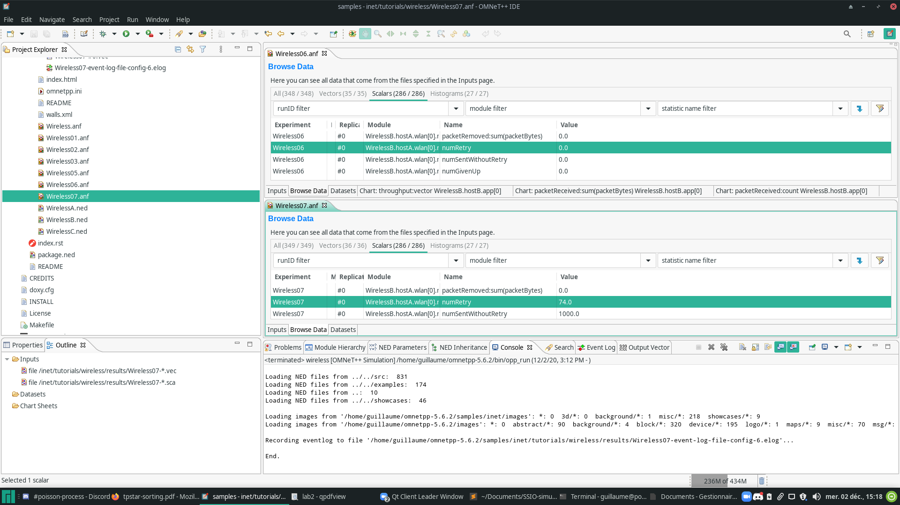
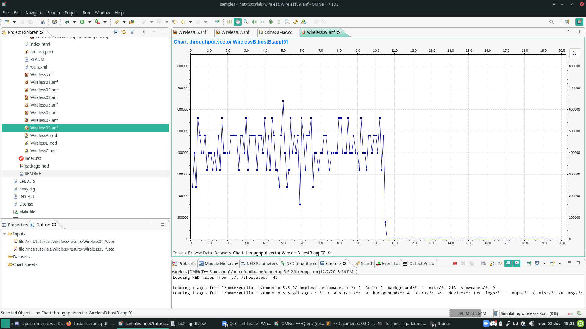

# Configuration 1 :

- Packets sent : 1596 ( 1596 * 1000 octets)
- Packets received : 1595 ( 1595 * 1000 octets)
- Transmission rate : 1595/1596 \~= 99.%


##### Is the **inter arrival time** for the packets memoryless? Explain your answer

Yes, the inter arrival time of the packets are memoryless. In the source code, we can see :

```c++
void UdpBasicApp::processSend()
{
    sendPacket();
    simtime_t d = simTime() + par("sendInterval"); /* Here, the interval between the next sent take not care about the last send. */
    if (stopTime < SIMTIME_ZERO || d < stopTime) {
        selfMsg->setKind(SEND);
        scheduleAt(d, selfMsg);
    }
    else {
        selfMsg->setKind(STOP);
        scheduleAt(stopTime, selfMsg);
    }
}
```
I think the inter arrival time is memory less. Indeed, the UDP packet are sent with the exponential law time interval (12ms) without ack.

#### Transmission rate calculus

Simulation time :20 s = 20 000 ms
Average interval : 12 ms

Average number of packet sent during the simulation time :
 20 000 / 12 = 1666

Now, we multiply the number of packet by the payload (1000 Bytes)
1666 * 1000 = 1 666 000 Bytes

Now we want the Bytes number per seconds (there are 20 seconds) :
1 666 000 / 20 = 83333,3333333 Bytes per seconds


Now, we want the result in bits, so we devide by 8 :
83333 * 8 = 666664 bits pers seconds

Last steps, we want the result in kbit per seconds, so we devide by 1 024 :
666664 / 1024 = 651 kbits per seconds.

In the simulation, we found that the average kbits per seconds was 678.8

___


#### Change the random number generator

We can manually change the seed by use this parameters :
```
num-rngs = 1
seed-0-mt = 42
```

Changing the RNG seed will impact some non-stochastics event, so, in that simulation, the number of packet sent will change (increase or decrease).

___

#### AckingWirelessInterface

The AckingWirelessInterface is accessible on this path :
`inet/src/inet/linklayer/acking/AckingWirelessInterface.ned`.


In the file, we can found this parameters :

```c++
string interfaceTableModule;
string energySourceModule = default("");
double bitrate @unit(bps);
```

#### Statistics

In the file of `UdpBasicApp.ned`, we can find the line for the througput configuration :
```c++
@statistic[throughput](title="throughput"; unit=bps; source="throughput(packetReceived)"; record=vector);
```

In this line, we can see several parameters :
 - The **title**  : This is the name of the statics that we can looking for in the results files.
 - The **unit**   : This is the result unit, here in bit per seconds.
 - The **source** : This is the filter to apply on the informations to get the statisitics.
 - The **record** : This is the category of the statistic, vector for *mutable* value, scalar for **final** value (set at the end)


# Configuration 2 :

We can change the communication range of the simulation in the ini file.
If we had these lines, we changes the communication range :

```
*.host*.wlan[0].radio.transmitter.communicationRange = 250m
```
Here the communication range will be 250 meters.

In the visual part of the simulation, we can see the circles of the communication range :



# Configuration 3 :

The type of the new wireless interval are **WirelessHost**, we can see it in the *WirelessB.ned* configuration file : 

```c++
network WirelessB extends WirelessA
{
    submodules:
        hostR1: <default("WirelessHost")> like INetworkNode {
            @display("p=250,300");
        }
        hostR2: <default("WirelessHost")> like INetworkNode {
            @display("p=150,450");
        }
        hostR3: <default("WirelessHost")> like INetworkNode {
            @display("p=350,450");
        }
}
```

# Configuration 4 :

We can display every Ip address of the simulated network by adding this line to the configuration :
```
*.visualizer.interfaceTableVisualizer.displayInterfaceTables = true
```

Resutlt :




# Configuration 5 :

To enable the Event log output, add this lines :
```
record-eventlog = true
eventlog-file = ${resultdir}/${configname}-event-log-file.elog
```

The event-log file save the behavior of the network during the simulation. Everytime an event occur (like packet sent, or ip address set with arp protocol), this event is writ in the logfile.

On the given screenshot, it is possible to see 3 possibilities :
 - The first part is a packet succesfully transported through the router.
 - The second part is a packet succesfully sent to the router but lost between the router and **B**.
 - The third part is a packet lost between **A** and the router.




# Configuration 6 :

We can see that the configuration 6 can transmit sucessfully more data than the configuration 5.
Indeed, in this configuration, the CSMA protocol is enabled, so, the sender will check if another devices are currently emitting, 
and, if so, it will wait that the communication stop to try another communication.
With this way, the number of collision decreased so the communication quality is better.

We can see the diference between the configuration in this picture :
(The config-5 without CSMA on the left, the config-6 with CSMA on the right)




# Configuraion 7 :

In the **configuration 6**, the protocol that ask to the hosts to retry a send of the packet if it was lost was disabled.
We can verify that by reading the numRetry statics that is **0** in the configuration number 6.

In the **configuration 7**, the *Ack* mechanism was enabled. So, when a packet is lost, after a timeout, the emitter will try to resend it.
We can verify that by reading the numRetry statistics that is **74** in the configuration number 7. (74 can change because of the stochastics simulation)



In the source file of Csma (`inet/src/inet/linklayer/csmaca/CsmaCaMac.cc`), we can see the implementation of the protocol.
The parameter numRetry is defined in this file and the statics are registered on line `127` :

```c++
recordScalar("numRetry", numRetry);
```

# Configuration 9 :

In the configuration 9, we can see that the transmission stopped between the seconds **10** and **11** :



Indeed, we can see that some hosts move and became out of range during the simulation.